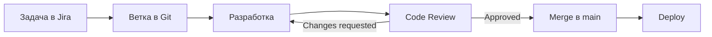
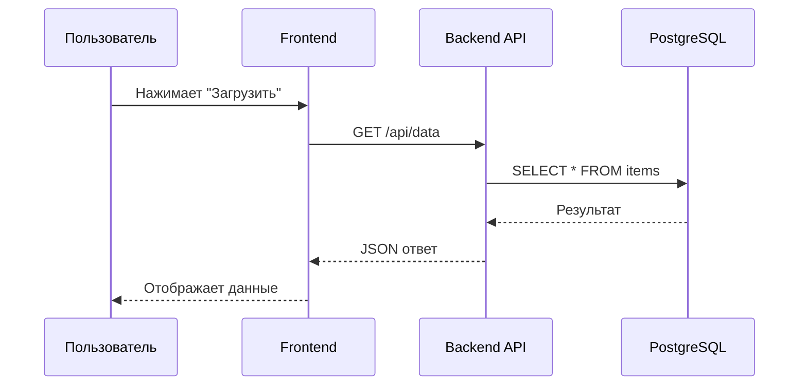
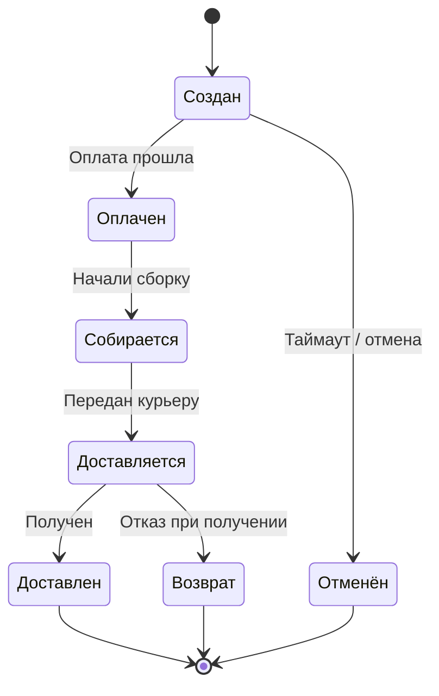
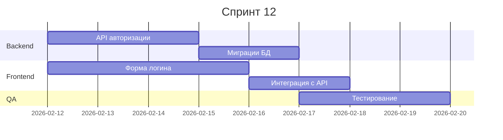

# Role Creator

Библиотека ролей и скиллов для AI-агентов. Централизованное хранилище персон, инструкций и справочных материалов для использования в разных проектах.

---

## Что это

**Role Creator** — проект для создания, хранения и публикации ролей и скиллов AI-агентов.

### Роли

Роли описывают поведение агента:
- **Кто** агент (персона, экспертиза)
- **Что** делает (задачи, обязанности)
- **Как** общается (тон, стиль)
- **Чего не делает** (ограничения)

### Скиллы

Скиллы — справочные материалы, которые подключаются к ролям:
- Редполитики и стандарты
- SEO-требования
- Чеклисты и гайдлайны

---

## Структура проекта

```
/Role Creator
├── /Roles                  ← Исходники ролей (рабочая папка)
│   ├── /meta               # Мета-роли (role-master, skill-master)
│   ├── /assistants         # Помощники и ассистенты
│   ├── /specialists        # Специалисты
│   ├── /creative           # Креативные роли
│   └── /templates          # Шаблоны ролей
│
├── /Skills                 ← Исходники скиллов
│   ├── skill-template.md   # Шаблон скилла
│   └── skill-*.md          # Скиллы
│
├── /Production             ← Опубликованные файлы (READ-ONLY)
│   ├── /Agents             # Роли по категориям
│   ├── /Dialog             # Загрузчики ролей для диалоговых ассистентов
│   ├── /Skills             # Скиллы
│   └── README.md           # Каталог всех ролей и скиллов
│
└── /scripts
    └── publish.sh          ← Скрипт публикации
```

---

## Мета-роли

Проект использует мета-роли для самообслуживания:

| Роль | Назначение |
|------|------------|
| **role-master** | Создание и оптимизация ролей AI-агентов |
| **skill-master** | Создание скиллов |
| **prompt-engineer-claude** | Инженер промптов для моделей Claude |

---

## Как использовать

### Для агентов из других проектов

Читайте роли и скиллы из папки `/Production`:

```
Роли: Production/Agents/{category}/{role}.md
Скиллы: Production/Skills/{skill}.md
```

Полный каталог: **[Production/README.md](Production/README.md)**

### Для диалоговых ассистентов (Claude.ai, ChatGPT, Gemini)

Используйте файлы из `Production/Dialog/` — они содержат инструкции для автоматической загрузки актуальной версии роли из GitHub репозитория.

### Для Claude Code

При запуске `publish.sh` роли автоматически копируются в `~/.claude/agents/` в формате `agent-{name}.md`.

---

## Редактирование

### Роли

1. Редактируйте файлы в `/Roles`
2. Используйте шаблон `/Roles/templates/role-template.md`
3. Или попросите **role-master** создать или обновить роль

### Скиллы

1. Редактируйте файлы в `/Skills`
2. Используйте шаблон `/Skills/skill-template.md`
3. Или попросите **skill-master** создать или обновить скилл

### Публикация

```bash
./scripts/publish.sh          # Публикация
./scripts/publish.sh --dry    # Просмотр без изменений
```

Скрипт:
- Копирует роли в `Production/Agents/`
- Копирует скиллы в `Production/Skills/`
- Генерирует заглушки в `Production/Dialog/`
- Обновляет `Production/README.md`
- Синхронизирует в `~/.claude/agents/`

---

## Правила

| Папка | Назначение | Права |
|-------|------------|-------|
| `/Roles` | Исходники ролей | Редактирование |
| `/Skills` | Исходники скиллов | Редактирование |
| `/Production` | Опубликованные файлы | Только чтение |

---

*Role Creator Project*

# Тестирование mermaid

# Примеры Mermaid-диаграмм

## 1. Процесс разработки фичи

Типичный flow от идеи до продакшена:



## 2. Взаимодействие сервисов

Как фронтенд получает данные:



## 3. Состояния заказа

Жизненный цикл заказа в интернет-магазине:



## 4. Планирование спринта

