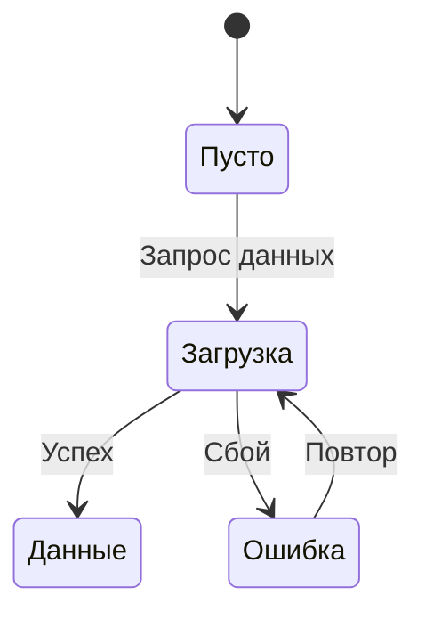

# Шаблон PRD

## Назначение

Структура PRD-документа: секции, формат требований (MoSCoW), таблица англицизмов, правила визуализации.

## Структура PRD

```markdown
# PRD: [Название]

## Обзор

**Функциональность:** [Краткое описание]
**Проблема:** [Какую проблему решаем]
**ЦА:** [Целевая аудитория]

## Executive Summary (для сложных задач)

- Ключевое решение в 2-3 предложениях
- Главные риски и зависимости
- Ожидаемый результат

## Бизнес-цели

- Зачем делаем
- Ожидаемый эффект
- Метрики успеха

## User Stories

### US-1: [Название]

Как [роль]
Я хочу [действие]
Чтобы [результат]

**Acceptance Criteria:**
- [ ] Критерий 1
- [ ] Критерий 2

## Функциональные требования

### Must Have
[Обязательные требования]

### Should Have
[Важные, но не блокирующие]

### Could Have
[Желательные]

### Won't Have (this release)
[Явно исключённые]

## Состояния и edge-cases

### Пустые состояния
[Первый запуск, нет данных]

### Состояния загрузки
[Скелетон, индикатор]

### Ошибки
[Сообщения, действия для повтора]

### Граничные случаи
[Мин/макс значения, пограничные условия]

## Зависимости

- Внешние системы и API
- Зависимости от других команд/сервисов
- Технические ограничения

## Аналитика

- Какие события трекать
- Ключевые метрики для дашборда
- Как измеряем успех после запуска

## Out of scope

- Что явно НЕ входит в текущую задачу

## Вопросы и риски

- Открытые вопросы
- Потенциальные риски
```

## MoSCoW-приоритизация требований

| Приоритет | Значение | Пример |
|---|---|---|
| **Must Have** | Без этого продукт не работает | Авторизация, основной сценарий |
| **Should Have** | Важно, но можно запустить без этого | Фильтрация, уведомления |
| **Could Have** | Улучшает опыт, но не критично | Анимации, персонализация |
| **Won't Have** | Явно исключено из текущего релиза | Интеграция с X, мобильное приложение |

ЕСЛИ пользователь не указал приоритеты -- предложить MoSCoW-разбивку для согласования.

## Таблица англицизмов

| Не использовать | Использовать |
|---|---|
| Юзер кликает на кнопку | Пользователь нажимает на кнопку |
| Заапрувить фичу | Утвердить функциональность |
| Добавить аттачмент к тикету | Приложить файл к задаче |
| Сделать ресерч | Провести исследование |
| Задеплоить на прод | Развернуть на production |
| Зарелизить фичу | Выпустить функциональность |
| Юзер флоу для онбординга | Сценарий первого запуска |
| Фидбэк от стейкхолдеров | Обратная связь от заинтересованных сторон |

**Допустимые англицизмы:** PRD, MVP, User Story, Acceptance Criteria, Agile, Sprint, Backlog, API, UX, A/B-тест, ROI, KPI, production, staging, edge case, happy path.

**Правило:** если есть нормальный русский эквивалент -- используй его. Англицизм допустим только для устоявшихся терминов без адекватного перевода.

## Визуализация

### Когда ASCII-диаграммы

- Простые линейные флоу (2-5 шагов)
- Документы для чтения в терминале/IDE

```
┌─────────────┐
│    Вход     │
└──────┬──────┘
       v
┌─────────────┐     Да      ┌──────────────┐
│  Проверка?  ├────────────>│   Успех      │
└──────┬──────┘             └──────────────┘
       │ Нет
       v
┌─────────────┐
│   Ошибка    │
└─────────────┘
```

### Когда Mermaid

- Схемы состояний UI (stateDiagram-v2)
- Флоу с ветвлениями (flowchart)
- Документы для рендеринга в браузере/GitHub



### Чего НЕ рисовать

- Детальные макеты интерфейсов
- Иллюстрации
- Сложные диаграммы классов или архитектуры
